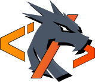

# 3C: Competitive Coding Challenges

---

Personal repository for solutions to Competitive Coding Challenges.

# Code Challenges

This repository is a collection of various coding and system design challenges, around the themes of mathematics, computational math,
golfing, DSA (data structures and algorithms) and holistic program architecture. There is a wide variety of categories and types of questions of varying
difficulty, which touch different areas of programming and problem-solving techniques.

## Problems

The challenges are structured by their rating or difficulty:

- **Tier:**  
  &emsp;_Easy_, _Medium_, _Hard_...
- **Numerical:**  
   &emsp;Difficulty score e.g. _0_-_5000_, _0.0_-_10.0_, or another scaling (where higher is more difficult)
- **Solve quotient:**  
  &emsp;Total number of _attempted solutions_ divided by _accepted solutions_ for the challenge: 
  &emsp; $$\frac{\text{attempts}}{\text{accepted solutions}}$$

Every challenge is accompanied by a problem statement, constraints, tags, source to where problem was originally
discovered or presented, optionally examples to illustrate the problem and expected solution behavior, and tests to
check the solution.

## Languages

The solutions to the problems in this repository are mostly written in Java, but other languages may also be included.
Note that tests are not available for languages other than Java.

## Golf

Additionally, there are miscellaneous novel challenges which don't necessarily have a final correct or expected answer. These are
intended to push your limits on the knowledge for specific programming languages, how they work under the hood, or purely for amusement. These may be code
golfing challenges or similar in nature.

## Forking

If you are interested in trying to solve these challenges yourself, you can fork
the [`@3C/template`](https://www.github.com/macweese/3c/tree/template) branch

For challenges not present in this repository,
e.g. recently added to LeetCode, use the generator CLI to automatically create a `README.md` for the challenge.
See “3C CLI” and the detailed docs in [cli/ccc/README](cli/ccc/README.md).

Problems are sourced from:

- Leetcode
- Project Euler
- CodeForces
- Kattis
- atCoder
- HackerRank
- TopCoder
- CodeWars
- CodinGame