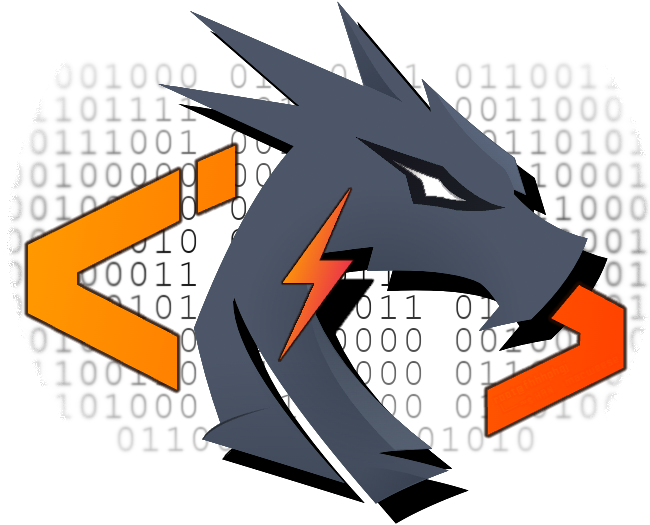

# 3C: Competitive Coding Challenges

---

Personal repository for solutions to Competitive Coding Challenges.

# Code Challenges

This repository is a collection of various coding challenges, around the themes of mathematics, computational math,
golfing, data structures and algorithms (DSA). There is a wide variety of categories or 'types' of questions of varying
difficulty, that touch different areas of programming and solution techniques.

## Problems

The challenges are structured by their rating or difficulty, of which there are 3 tiers of:

- Easy
- Medium
- Hard  
  or a numerical difficulty score 0-5000 (where higher is more difficult)

Every challenge is accompanied by a problem statement, constraints, tags, web-link to where problem was originally
discovered or presented, optionally examples to illustrate the problem and expected solution behavior, and tests to
check the solution.

## Language

The solutions to the problems in this repository are mostly written in Java, but other languages may also be included.
Note that tests are not available for languages other than Java.

## Golf

Additionally, there are miscellaneous novel challenges which don't have a final correct or expected answer. These are
intended to push your limits on the knowledge for specific programming languages, and how they work. These may be code
golfing challenges or similar in nature.

## Forking

If you are interested in trying to solve these challenges yourself, you can fork
the [`@3C/template branch`](https://www.github.com/macweese/3c/tree/template)

Problems are sourced from:

- Leetcode
- atcoder
- CodeForces
- Project Euler
- HackerRank
- TopCoder
- CodeWars
- CodinGame