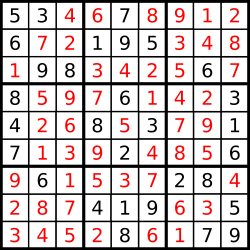

# 37. Sudoku Solver

<h3 style="color:#FF4800;">Hard</h3>

[LeetCode 37](https://leetcode.com/problems/sudoku-solver/)

## >Description

Write a program to solve a Sudoku puzzle by filling the empty cells.

A sudoku challenge must satisfy **all the following rules**:

1. Each of the digits `1-9` must occur exactly once in each row.
2. Each of the digits `1-9` must occur exactly once in each column.
3. Each of the digits `1-9` must occur exactly once in each of the 9 3x3 sub-boxes of the grid.

The `'.'` character indicates empty cells.

 

#### Example 1

<b>Input:</b>

    board = 
    [["5","3",".",".","7",".",".",".","."],
    ["6",".",".","1","9","5",".",".","."],
    [".","9","8",".",".",".",".","6","."],
    ["8",".",".",".","6",".",".",".","3"],
    ["4",".",".","8",".","3",".",".","1"],
    ["7",".",".",".","2",".",".",".","6"],
    [".","6",".",".",".",".","2","8","."],
    [".",".",".","4","1","9",".",".","5"],
    [".",".",".",".","8",".",".","7","9"]]

<b>Output:</b>

    [["5","3","4","6","7","8","9","1","2"],
    ["6","7","2","1","9","5","3","4","8"],
    ["1","9","8","3","4","2","5","6","7"],
    ["8","5","9","7","6","1","4","2","3"],
    ["4","2","6","8","5","3","7","9","1"],
    ["7","1","3","9","2","4","8","5","6"],
    ["9","6","1","5","3","7","2","8","4"],
    ["2","8","7","4","1","9","6","3","5"],
    ["3","4","5","2","8","6","1","7","9"]]

<b>Explanation:</b>

The input board is shown above and the only valid challenge is shown below:

### Constraints:

* `board.length == 9`
* `board[i].length == 9`
* `board[i][j]` is a digit or `'.'`.
* It is **guaranteed** that the input board has only one challenge.

 

## >Solution

### Intuition

### Approach

### Complexity analysis

$$
\begin{flalign}&
n \ \stackrel{\text{def}}{=}
\text{elements}
&\end{flalign}
$$

$$
\begin{flalign} &
m \stackrel{\text{def}}{=} \text{arrays}
& \end{flalign}
$$

#### Time Complexity

- Time complexity: $ O(1) $
  Constant time.

#### Space Complexity

- Space complexity: $ O(1) $
  No extra space is used.

---

 

#### Tags

`array`
`hash table`
`backtracking`
`matrix`

---

#### Hints

  
Hint 1

For each cell, place a valid number and try solving for the remaining empty cells.

  
Hint 2

If stuck, undo (backtrack) and try another valid number.

 

---

#### Similar

**LeetCode** (website)

- [36 Valid Sudoku](https://leetcode.com/problems/valid-sudoku/)
- [980 Unique Paths III](https://leetcode.com/problems/unique-paths-iii/)

**Local** (repository)

- [36 Valid Sudoku](../../medium/validSudoku)
- [980 Unique Paths III](../../hard/uniquePathsIII)

---

**POTD** `2025-08-31, Sun
 31 August 2025`

[comment]: #
[comment]: #
[comment]: #

 

**Notes**  

