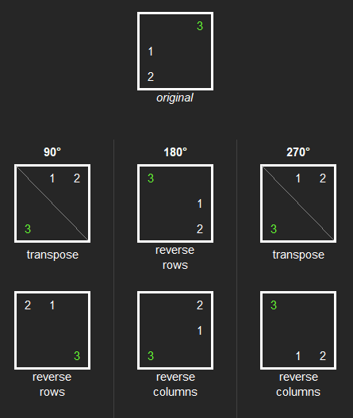

[comment]: # ( ----- THIS FILE IS AUTO-GENERATED ----- )

# 1886. Determine Whether Matrix Can Be Obtained By Rotation

<h3 style="color:#3BE38C;">Easy</h3>

[LeetCode 1886](https://leetcode.com/problems/determine-whether-matrix-can-be-obtained-by-rotation/)

## Description

Given two <code>n x n</code> binary matrices <code>mat</code> and <code>target</code>, return <code>true</code><em> if it is possible to make </em><code>mat</code><em> equal to </em><code>target</code><em> by <strong>rotating</strong> </em><code>mat</code><em> in <strong>90-degree increments</strong>, or </em><code>false</code><em> otherwise.</em>

#### Example 1

<b>Input:</b>
<pre style="margin-left: 40px">
mat = [[0,1],[1,0]], target = [[1,0],[0,1]]
</pre>

<b>Output:</b>
<pre style="margin-left: 40px">
true
</pre>

<b>Explanation:</b>
<pre style="margin-left: 40px">
We can rotate mat 90 degrees clockwise to make mat equal target.
</pre>

 

#### Example 2

<b>Input:</b>
<pre style="margin-left: 40px">
mat = [[0,1],[1,1]], target = [[1,0],[0,1]]
</pre>

<b>Output:</b>
<pre style="margin-left: 40px">
false
</pre>

<b>Explanation:</b>
<pre style="margin-left: 40px">
It is impossible to make mat equal to target by rotating mat.
</pre>

 

#### Example 3

<b>Input:</b>
<pre style="margin-left: 40px">
mat = [[0,0,0],[0,1,0],[1,1,1]], target = [[1,1,1],[0,1,0],[0,0,0]]
</pre>

<b>Output:</b>
<pre style="margin-left: 40px">
true
</pre>

<b>Explanation:</b>
<pre style="margin-left: 40px">
We can rotate mat 90 degrees clockwise two times to make mat equal target.
</pre>

 

### Constraints:

<ul>
<li><code>n == mat.length == target.length</code></li>
<li><code>n == mat[i].length == target[i].length</code></li>
<li><code>1 &lt;= n &lt;= 10</code></li>
<li><code>mat[i][j]</code> and <code>target[i][j]</code> are either <code>0</code> or <code>1</code>.</li>
</ul>

 

---

 

#### Tags

`array`
`matrix`

---

**Hints**

  
Hint 1

  What is the maximum number of rotations you have to check?

  
Hint 2

  Is there a formula you can use to rotate a matrix 90 degrees?

 

---

#### Similar

**LeetCode** (website)

* [48 Rotate Image](https://leetcode.com/problems/rotate-image/)

**Local** (repository)

* <!-- Fill in local links if you have corresponding solutions -->

---

**POTD**

`2026-03-22, Sun 22 March 2026`

[comment]: # (comments...)

 

**Notes**

<!-- Your notes -->

[comment]: # (notes...)

[comment]: # ( ----- THIS FILE IS AUTO-GENERATED ----- )