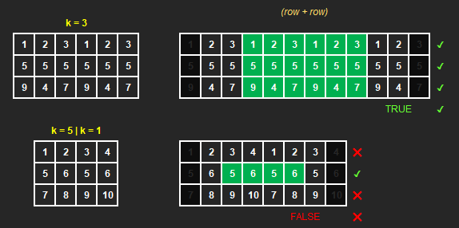

[comment]: # ( ----- THIS FILE IS AUTO-GENERATED ----- )

# 2946. Matrix Similarity After Cyclic Shifts

<h3 style="color:#3BE38C;">Easy</h3>

[LeetCode 2946](https://leetcode.com/problems/matrix-similarity-after-cyclic-shifts/)

## Description

You are given an <code>m x n</code> integer matrix <code>mat</code> and an integer <code>k</code>. The matrix rows are 0-indexed.

The following proccess happens <code>k</code> times:
<ul>
<li><strong>Even-indexed</strong> rows (0, 2, 4, ...) are cyclically shifted to the left.</li>
</ul>

### Constraints:

<ul>
<li><code>1 &lt;= mat.length &lt;= 25</code></li>
<li><code>1 &lt;= mat[i].length &lt;= 25</code></li>
<li><code>1 &lt;= mat[i][j] &lt;= 25</code></li>
<li><code>1 &lt;= k &lt;= 50</code></li>
</ul>

 

---

 

#### Tags

`array`
`math`
`matrix`
`simulation`

---

**Hints**

  
Hint 1

  You can reduce &lt;code&gt;k&lt;/code&gt; shifts to &lt;code&gt;(k % n)&lt;/code&gt; shifts as after &lt;code&gt;n&lt;/code&gt; shifts the matrix will become similar to the initial matrix.

 

---

#### Similar

**LeetCode** (website)

* <!-- No similar problems or unavailable -->

**Local** (repository)

* <!-- Fill in local links if you have corresponding solutions -->

---

**POTD**

`2026-03-27, Fri 27 March 2026`

[comment]: # (comments...)

 

**Notes**

<!-- Your notes -->

[comment]: # (notes...)

[comment]: # ( ----- THIS FILE IS AUTO-GENERATED ----- )