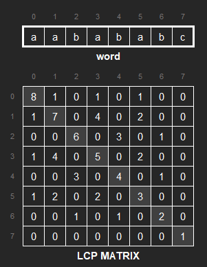
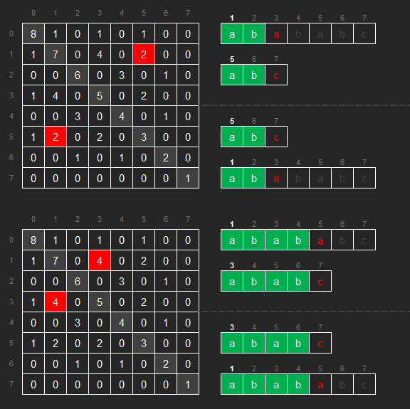
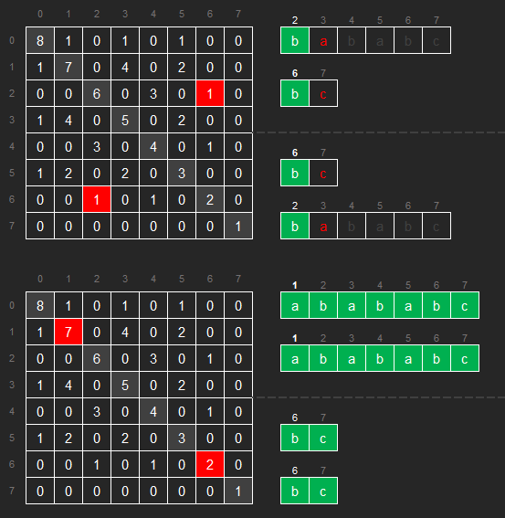

[comment]: # ( ----- THIS FILE IS AUTO-GENERATED ----- )

# 2573. Find the String with LCP

<h3 style="color:#FF4800;">Hard</h3>

[LeetCode 2573](https://leetcode.com/problems/find-the-string-with-lcp/)

## Description

We define the <code>lcp</code> matrix of any <strong>0-indexed</strong> string <code>word</code> of <code>n</code> lowercase English letters as an <code>n x n</code> grid such that:
<ul>
<li><code>lcp[i][j]</code> is equal to the length of the <strong>longest common prefix</strong> between the substrings <code>word[i,n-1]</code> and <code>word[j,n-1]</code>.</li>
</ul>
Given an <code>n x n</code> matrix <code>lcp</code>, return the alphabetically smallest string <code>word</code> that corresponds to <code>lcp</code>. If there is no such string, return an empty string.

A string <code>a</code> is lexicographically smaller than a string <code>b</code> (of the same length) if in the first position where <code>a</code> and <code>b</code> differ, string <code>a</code> has a letter that appears earlier in the alphabet than the corresponding letter in <code>b</code>. For example, <code>"aabd"</code> is lexicographically smaller than <code>"aaca"</code> because the first position they differ is at the third letter, and <code>'b'</code> comes before <code>'c'</code>.

#### Example 1

<b>Input:</b>
<pre style="margin-left: 40px">
lcp = [[4,0,2,0],[0,3,0,1],[2,0,2,0],[0,1,0,1]]
</pre>

<b>Output:</b>
<pre style="margin-left: 40px">
"abab"
</pre>

<b>Explanation:</b>
<pre style="margin-left: 40px">
lcp corresponds to any 4 letter string with two alternating letters. The lexicographically smallest of them is "abab".
</pre>

 

#### Example 2

<b>Input:</b>
<pre style="margin-left: 40px">
lcp = [[4,3,2,1],[3,3,2,1],[2,2,2,1],[1,1,1,1]]
</pre>

<b>Output:</b>
<pre style="margin-left: 40px">
"aaaa"
</pre>

<b>Explanation:</b>
<pre style="margin-left: 40px">
lcp corresponds to any 4 letter string with a single distinct letter. The lexicographically smallest of them is "aaaa".
</pre>

 

#### Example 3

<b>Input:</b>
<pre style="margin-left: 40px">
lcp = [[4,3,2,1],[3,3,2,1],[2,2,2,1],[1,1,1,3]]
</pre>

<b>Output:</b>
<pre style="margin-left: 40px">
""
</pre>

<b>Explanation:</b>
<pre style="margin-left: 40px">
lcp[3][3] cannot be equal to 3 since word[3,...,3] consists of only a single letter; Thus, no answer exists.
</pre>

 

### Constraints:

<ul>
<li><code>1 &lt;= n == </code><code>lcp.length == </code><code>lcp[i].length</code> <code>&lt;= 1000</code></li>
<li><code>0 &lt;= lcp[i][j] &lt;= n</code></li>
</ul>

 

---

 

#### Tags

`array`
`string`
`dynamic programming`
`greedy`
`union-find`
`matrix`

---

**Hints**

  
Hint 1

  Use the LCP array to determine which groups of elements must be equal.

  
Hint 2

  Match the smallest letter to the group that contains the smallest unassigned index.

  
Hint 3

  Build the LCP matrix of the resulting string then check if it is equal to the target LCP.

 

---

#### Similar

**LeetCode** (website)

* <!-- No similar problems or unavailable -->

**Local** (repository)

* <!-- Fill in local links if you have corresponding solutions -->

---

**POTD**

`2026-03-28, Sat 28 March 2026`

[comment]: # (comments...)

 

**Notes**

<!-- Your notes -->

[comment]: # (notes...)

[comment]: # ( ----- THIS FILE IS AUTO-GENERATED ----- )