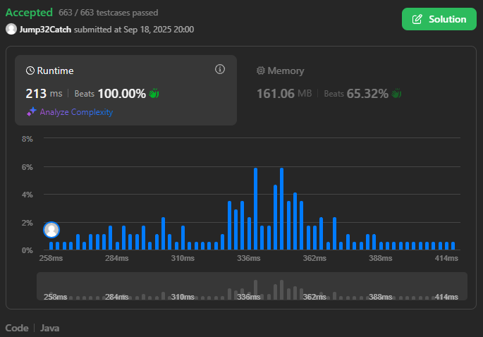

# 3408. Design Task Manager

<h3 style="color:#E39A2D;">Medium</h3>

[LeetCode 3408](https://leetcode.com/problems/design-task-manager/)

## Description

There is a task management system that allows users to manage their tasks, each associated with a priority. The system should efficiently handle adding, modifying, executing, and removing tasks.

Implement the `TaskManager` class:

* `TaskManager(vector<vector<int>>& tasks)` initializes the task manager with a list of user-task-priority triples. Each element in the input list is of the form `[userId, taskId, priority]`, which adds a task to the specified user with the given priority.
* `void add(int userId, int taskId, int priority)` adds a task with the specified `taskId` and `priority` to the user with `userId`. It is **guaranteed** that `taskId` does not exist in the system.
* `void edit(int taskId, int newPriority)` updates the priority of the existing `taskId` to `newPriority`. It is **guaranteed** that `taskId` _exists_ in the system.
* `void rmv(int taskId)` removes the task identified by `taskId` from the system. It is **guaranteed** that `taskId` _exists_ in the system.
* `int execTop()` executes the task with the **highest** priority across all users. If there are multiple tasks with the same **highest** priority, execute the one with the highest `taskId`. After executing, the `taskId` is **removed** from the system. Return the `userId` associated with the executed task. If no tasks are available, return -1.

**Note** that a user may be assigned multiple tasks.

 

#### Example 1

<b>Input:</b>

`["TaskManager", "add", "edit", "execTop", "rmv", "add", "execTop"] [[[[1, 101, 10], [2, 102, 20], [3, 103, 15]]], [4, 104, 5], [102, 8], [], [101], [5, 105, 15], []]`

<b>Output:</b>

`[null, null, null, 3, null, null, 5]`

<b>Explanation:</b>

    // See comments in code --->
    TaskManager taskManager = new TaskManager([[1, 101, 10], [2, 102, 20], [3, 103, 15]]);  // Initializes with three tasks for Users 1, 2, and 3.
    taskManager.add(4, 104, 5);                                                             // Adds task 104 with priority 5 for User 4.
    taskManager.edit(102, 8);                                                               // Updates priority of task 102 to 8.
    taskManager.execTop();                                                                  // return 3. Executes task 103 for User 3.
    taskManager.rmv(101);                                                                   // Removes task 101 from the system.
    taskManager.add(5, 105, 15);                                                            // Adds task 105 with priority 15 for User 5.
    taskManager.execTop();                                                                  // return 5. Executes task 105 for User 5.

 

    // Code                                         // Code explanation
    TaskManager taskManager = new TaskManager(      // Initializes with three tasks for Users 1, 2, and 3.
        [
            [1, 101, 10],                           // Tasks for User 1: taskId of 101 with priority 10.
            [2, 102, 20],                           // Tasks for User 2: taskId of 102 with priority 20.
            [3, 103, 15]                            // Tasks for User 3: taskId of 103 with priority 15.
        ]);
    taskManager.add(4, 104, 5);                     // Adds task 104 with priority 5 for User 4.
    taskManager.edit(102, 8);                       // Updates priority of task 102 to 8.
    taskManager.execTop();                          // return 3. Executes task 103 for User 3.
    taskManager.rmv(101);                           // Removes task 101 from the system.
    taskManager.add(5, 105, 15);                    // Adds task 105 with priority 15 for User 5.
    taskManager.execTop();                          // return 5. Executes task 105 for User 5.

 

Internal inspection of `TaskManager` lifecycle:
    
    CALL		USER	ID	TASK ID	        PRIORITY
    
    INIT		2		102		20
                    1		101		10
                    3		103		15
                    USER ID         TASK ID	        PRIORITY
                    2		102		20
                    1		101		10
                    3		103		15
    
    ADD		4		104		5
                    USER ID         TASK ID	        PRIORITY
                    2		102		20
                    3		103		15
                    1		101		10
                    4		104		5
    
    EDIT				102		8
                    USER ID         TASK ID	        PRIORITY
                    3		103		15
                    1		101		10
                    2		102		8
                    4		104		5
    
    EXECTOP->
    POP		3		103		15
                    USER ID         TASK ID	        PRIORITY
                    1		101		10
                    2		102		8
                    4		104		5
    
    RMV				101
                    USER ID         TASK ID	        PRIORITY
                    2		102		8
                    4		104		5
    
    ADD		5		105		15
                    USER ID         TASK ID	        PRIORITY
                    5		105		15
                    2		102		8
                    4		104		5
    
    EXECTOP->
    POP		5		105		15
                    USER ID         TASK ID	        PRIORITY
                    2		102		8
                    4		104		5

### Constraints:

* <code>1 &le; tasks.length &le; 105</code>
* <code>1 &le; userId  &le; 105</code>
* <code>1 &le; taskId   &le; 105</code>
* <code>1 &le; priority    &le; 109</code>
* <code>1 &le; newPriority     &le; 109</code>
* At most <code>2 &times; 105</code> calls will be made in **total** to `add`, `edit`, `rmv`, and `execTop` methods.
* The input is generated such that `taskId` will be valid.

 

## Solution

### Intuition

Intuition
The problem requires a data structure that can efficiently handle priority-based operations like finding the top-priority task and removing it, but also needs to efficiently handle arbitrary **task updates** by `taskId`. A standard priority queue (or max-heap) is perfect for the priority-based operations ($ O(logn) $  for `add` and `execTop`) but is inefficient for updates like `edit` and `rmv`, which would require an $ O(n) $  search to find the element first.

To solve this, a hybrid approach is chosen. By combining the behavior of a max-heap (for efficient priority operations) with a hash map (for efficient lookups by `taskId`), we can achieve a highly optimized solution. The hash map allows us to find the index of any task in $ O(1) $ average time, which makes updating or removing it in the heap an $ O( \log{n}) $  operation. This combined structure is what makes the solution efficient for all required operations.

Furthermore, we can optimize the performance for small numbers of tasks. For a very small list, a simple linear scan to find the maximum priority element is actually faster than the overhead of a heap's `siftUp` or `siftDown` operations. This suggests a **two-mode system**: one for small lists (linear scan) and one for large lists (heap). The solution switches between these modes based on the number of tasks, which reduces overhead and optimizes performance across different scales.

### Approach

The solution implements a hybrid data structure that combines the behavior of a binary heap and a hash map, backed by parallel primitive arrays and data packing for improved performance and memory efficiency. The core idea is to implement a priority queue from scratch using arrays and add an auxiliary array for quick lookups.
This avoids using a TreeSet and the costly comparator/object overhead.

Reasons for this approach:

* No TreeSet/Comparator object churn; the heap is array-based with primitives.
* Point updates (edit/remove) operate by index, avoiding remove-then-add lookups in a tree.
* Tie-breaking is resolved with simple integer comparisons.
* Direct addressing for positions: `pos[taskId]` replaces use for `HashMap`, eliminating boxing, hashing, and table indirections entirely.
* Pre-allocation: Arrays are sized once for the worst concurrent task count, removing any copying/resizing cost.
* Bubble heap ops: siftUp/siftDown move a “hole” and write-back once, cutting array writes roughly in half versus repeated swaps.
* Composite key: a single long comparison replaces two integer compares and branches.

The heap arrays are indexed from `1`, which simplifies the math for parent-child relationships (parent of `i` is `i >>> 1` or `i << 2`, children are `i << 1` or `2 * i` and `i << 1 | 1` or `2 * i + 1`). This is a common practice in C-style heap implementations.

#### Data Structure Components

* `long[] key`
  An array that represents the binary max-heap. Each `long` element stores a packed key containing both a task's `priority` and its `taskId`. The heap is ordered based on this key, with higher priority values at the top. The `taskId` is included as a tie-breaker, ensuring that tasks with the same priority are sorted by `taskId`.
* `long[] payload`
  A parallel array to key. Each `long` element stores a packed payload containing the `userId` and `taskId`.
* `int[] pos`
  An auxiliary array that acts as a hash map. The `taskId` is used as the index, and the value is the current position (index) of that task within the `key` and `payload` arrays. This is a critical component that enables $ O(1) $  lookups for updates.

#### Core Operations

* `packKey` and `packPayload`
  These are helper methods that pack two `int` values into a single `long`. This is a low-level optimization to improve data locality and memory efficiency by storing related information in a single primitive type.
* `add(userId, taskId, priority)`
  A new task is added to the end of the arrays. If the system is in heap mode, it performs a `siftUp` operation to maintain the heap property. If not, it simply adds the task. If the total number of tasks exceeds a predefined `upgradeThreshold`, the entire structure is converted into a heap using `heapify`.
* `edit(taskId, newPriority)`
  The `pos` array is used to find the task's current index in $ O(1) $  time. The new priority is packed into the key. The function then checks if the task's new priority is higher or lower than its parent's, performing either a `siftUp` or `siftDown` operation to restore the heap property. This is a significant improvement over a standard heap, where finding the element to update would take $ O(n) $  time.
* `rmv(taskId)`
  The `pos` array finds the task's index. The task is removed by swapping it with the last element in the array. The size is then decremented. A `siftUp` or `siftDown` is then performed on the new element at the removed task's original position to restore the heap property.
* `execTop()` This method has two modes of operation:

  * **Linear Scan Mode:**
    If the size is below the `upgradeThreshold`, it performs a simple linear scan of the `key` array to find the highest priority task. This avoids the overhead of heap operations for small collections.
  * **Heap Mode:**
    If the size is above the threshold, it retrieves the top element (at index 1), replaces it with the last element, and then performs a `siftDown` operation to restore the heap property. This is the standard heap extraction process. After the operation, it checks if the size has fallen below a `downgradeThreshold` and switches back to linear scan mode if necessary.
* `siftUp` and `siftDown`
  These are the standard binary heap helper functions to maintain the heap property after an `add` or `execTop` operation.

### Complexity analysis

#### Time Complexity

* Time complexity: $ O(\log{n})  \lor  O(n) $

| Component             | Complexity (heap mode)                          | Complexity (linear mode)    |
|-----------------------|-------------------------------------------------|-----------------------------|
| `TaskManager` (ctor)¹ | $ O ( n ) $                                     | $ O (n) $                   |
| `add()`               | $ O ( \log{n} ) $ due to `siftUp`               | -                           |
| `edit()`              | $ O ( \log{n} ) $ due to `siftUp` or `siftDown` | Lookup via `pos`; $ O (1) $ |
| `rmv()`               | $ O ( \log{n} ) $ due to `siftUp` or `siftDown` | Lookup via `pos`: $ O (1) $ |
| `execTop()`           | $ O ( \log{n} ) $ due to `siftDown`             | $ O (1) $                   |

[1] `TaskManager (constructor)`: $ O(n) $ , where $ n $  is the number of initial tasks. If the initial size is greater than the `upgradeThreshold`, it will perform a `heapify` operation which takes $ O(n) $ time (equal to building heap).

#### Space Complexity

* Space complexity: $ O( N + M) $
  Where $ N $ is the maximum number of concurrent tasks and $ M $ is the maximum possible `taskId`. The arrays `key`, `payload`, and `pos` each require space proportional to their size. The `pos` array, in particular, is pre-allocated up to `MAX_TASK_ID`, which is a significant factor in the space complexity.

### Summary

The solution uses a hybrid approach for task management, which switches between two modes. For a small number of tasks, it uses a simple linear scan, which is faster due to less overhead. When the task count grows, it shifts to a heap mode for better performance.

The system is built on an array-based binary heap with two parallel arrays: `key` for packed priority data and `payload` for packed task data. This is similar to Java's built-in `PriorityQueue` but with custom optimizations. A third array, `pos`, acts as a hash map, providing constant-time $ O(1) $ lookups for `edit` and `rmv` operations.

This combination of a heap for efficient priority operations and a hash map for quick lookups makes the solution highly effective. It's a custom-built, high-performance system designed for specific workloads.

#### Advantages
The hybrid approach and $ O(1) $ lookups for updates (`edit` and `rmv`) are highly effective for a specific workload where tasks are frequently added, removed, or their priorities change.
Packing two integers into a single `long` can save memory compared to storing separate objects, although this is a micro-optimization.

#### Disadvantages & Considerations
The code is more complex and harder to read / maintain than using the standard `java.util.PriorityQueue`.
It's a bespoke solution tailored to a specific problem. You can't easily adapt it for different types of data without modifying the `pack` and `unpack` methods.
The `pos` array is fixed at `MAX_TASK_ID + 1`, which makes the solution inflexible. If a task ID exceeds this limit, it won't work. This also means it can be memory-intensive if `MAX_TASK_ID` is very large but the number of active tasks is small.

---

---

 

#### Tags

`hash table`
`design`
`heap`
`priority queue`
`ordered set`
`biweekly contest 147`

---

 

**POTD** `2025-09-18, Thu 18 September 2025`

 

**Notes**

[comment]: #
[comment]: #
[comment]: #
