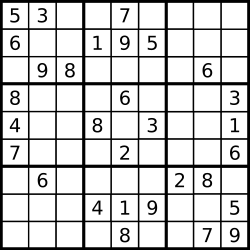

# 36. Valid Sudoku

<h3 style="color:#E39A2D;">Medium</h3>

[LeetCode 36](https://leetcode.com/problems/valid-sudoku/)

## Description

Determine if a <code>9 &times; 9</code> Sudoku board is valid. Only the filled cells need to be validated **according to the following rules**:

1. Each row must contain the digits `1-9` without repetition.
2. Each column must contain the digits `1-9` without repetition.
3. Each of the nine <code>3 &times; 3</code> sub-boxes of the grid must contain the digits `1-9` without repetition.

**Note:**

* A Sudoku board (partially filled) could be valid but is not necessarily solvable.
* Only the filled cells need to be validated according to the mentioned rules.


<br>


#### Example 1
<div style="margin-left: 40px">



<b>Input:</b>
<div style="margin-left: 40px">

    board =
    [["5","3",".",".","7",".",".",".","."]
    ,["6",".",".","1","9","5",".",".","."]
    ,[".","9","8",".",".",".",".","6","."]
    ,["8",".",".",".","6",".",".",".","3"]
    ,["4",".",".","8",".","3",".",".","1"]
    ,["7",".",".",".","2",".",".",".","6"]
    ,[".","6",".",".",".",".","2","8","."]
    ,[".",".",".","4","1","9",".",".","5"]
    ,[".",".",".",".","8",".",".","7","9"]]
</div>
<b>Output:</b>  
<div style="margin-left: 40px">

`true`
</div>

</div>

#### Example 2
<div style="margin-left: 40px">

<b>Input:</b>
<div style="margin-left: 40px">

    board = 
    [["8","3",".",".","7",".",".",".","."]
    ,["6",".",".","1","9","5",".",".","."]
    ,[".","9","8",".",".",".",".","6","."]
    ,["8",".",".",".","6",".",".",".","3"]
    ,["4",".",".","8",".","3",".",".","1"]
    ,["7",".",".",".","2",".",".",".","6"]
    ,[".","6",".",".",".",".","2","8","."]
    ,[".",".",".","4","1","9",".",".","5"]
    ,[".",".",".",".","8",".",".","7","9"]]

</div>
<b>Output:</b>  
<div style="margin-left: 40px">

`false`
</div>

<b>Explanation:</b>

<div style="margin-left: 40px">

Same as Example 1, except with the <u><b><span style="color:#FF4800;">5</span></b></u> in the top left corner (<code>board[0][0]</code>) being modified to <u><b><span style="color:#FF4800;">8</span></b></u>.
Since there are now two 8's in the first column, and would be two 8's in the top left 3x3 sub-box, it is invalid.

</div>
</div>


### Constraints:

* `board.length == 9`
* `board[i].length == 9`
* `board[i][j]` is a digit 1-9 or `'.'`.

<br>

## Solution

### Intuition

### Approach

### Complexity analysis

$$
\begin{flalign}&
n \ \stackrel{\text{def}}{=}
\text{grid size}
&\end{flalign}
$$

#### Time Complexity

* Time complexity: $ O(1) $  
  Constant time for a standard sudoku grid, albeit technically $ O(n^2) $ for *all* sudoku grids.  
  This is because the algorithm will, at worst case, need to check every cell ($  n \text{ rows} \times n\text{ columns} $).

#### Space Complexity

* Space complexity: $ O(1) $
  No extra space is used.

---

### Code

```cpp
class Solution
{
public:
    bool isValidSudoku(vector<vector<char>>& board)
    {
        bitset<9> rows[9], cols[9], boxes[9];
        
        for (int i = 0; i < board[i].size(); ++i)
        {
            for (int j = 0; j < board[j].size(); ++j)
            {
                if (!isdigit(board[i][j]))
                {
                    continue;
                }
                
                int num = board[i][j] - '1';
                int box = (i / 3) * 3 + (j / 3);
                
                if (rows[i][num] || cols[j][num] || boxes[box][num])
                {
                    return false;
                }
                
                rows[i][num] = cols[j][num] = boxes[box][num] = 1;
            }
        }
        
        return true;
    }
};
```

<br>

#### Tags

`array`
`hash table`
`matrix`

---


<details>
  <summary>Hint 1</summary>


</details>

<details>
  <summary>Hint 2</summary>


</details>


<details>
  <summary>Hint 3</summary>


</details>

<br>

---

#### Similar

**LeetCode** (website)

* [37 Sudoku Solver](https://leetcode.com/problems/sudoku-solver/)
* [2133 Check if Every Row and Column Contains All Numbers](https://leetcode.com/problems/check-if-every-row-and-column-contains-all-numbers/)

**Local** (repository)

* [37 Sudoku Solver](../../hard/sudokuSolver)
* [2133 Check if Every Row and Column Contains All Numbers](../../easy/checkIfEveryRowAndColumnContainsAllNumbers)

---

**POTD** `2025-08-30, Sat
 30 August 2025`

[comment]: #
[comment]: #
[comment]: #

<br>

**Notes**  


