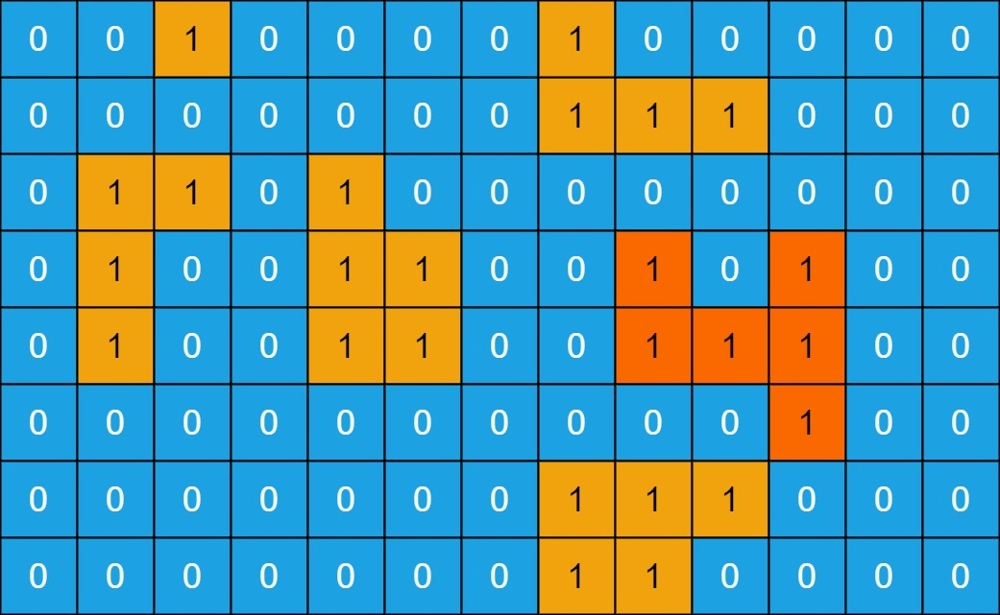

# 695. Max Area of Island

<h3 style="color:#E39A2D;">Medium</h3>

[LeetCode 695](https://leetcode.com/problems/max-area-of-island/)

## Description

You are given an <code>m &times; n</code> binary matrix grid. An island is a group of `1`'s (representing land) connected **4-directionally** (horizontal or vertical). You may assume all four edges of the grid are surrounded by water.

The **area** of an island is the number of orthogonally connected cells with a value `1` in the matrix.

Return _the maximum **area** of an island in_ `grid`. If there is no island, return `0`.

 

#### Example 1

<b>Input:</b>

    grid =  [[0,0,1,0,0,0,0,1,0,0,0,0,0]
		,[0,0,0,0,0,0,0,1,1,1,0,0,0]
		,[0,1,1,0,1,0,0,0,0,0,0,0,0]
		,[0,1,0,0,1,1,0,0,1,0,1,0,0]
		,[0,1,0,0,1,1,0,0,1,1,1,0,0]
		,[0,0,0,0,0,0,0,0,0,0,1,0,0]
		,[0,0,0,0,0,0,0,1,1,1,0,0,0]
		,[0,0,0,0,0,0,0,1,1,0,0,0,0]]

<b>Output:</b>

`6`

<b>Explanation:</b>

The answer is not 11, because the island must be connected orthogonally.  

#### Example 2

<b>Input:</b>

	grid = [[0,0,0,0,0,0,0,0]]

<b>Output:</b>

`0`

### Constraints:

* `m == grid.length`
* `n == grid[i].length`
* <code>1 &le; m, n &le; 50</code>
* `grid[i][j]` is either `0` or `1`.

 

## Solution

### Intuition

### Approach

### Complexity analysis

$$
\begin{flalign}&
n \ \stackrel{\text{def}}{=}
\text{placeholder}
&\end{flalign}
$$

$$
\begin{flalign} &
m \stackrel{\text{def}}{=} \text{placeholder}
& \end{flalign}
$$

#### Time Complexity

* Time complexity: $ O(1) $
  Constant time.

#### Space Complexity

* Space complexity: $ O(1) $
  No extra space is used.

---

[comment]: # ( --- AC image --- )

---

 

#### Tags

`array`
`dfs`
`depth-first-search`
`bfs`
`breadth-first-search`
`union find`
`matrix`

 

---

#### Similar

**LeetCode** (website)

* &ensp;[463 Island Perimeter](https://leetcode.com/problems/island-perimeter/)
* &ensp;[200 Number Of Islands](https://leetcode.com/problems/number-of-islands/)
* &ensp;[419 Battleships In A Board](https://leetcode.com/problems/battleships-in-a-board/)
* [1727 Largest Submatrix With Rearrangements](https://leetcode.com/problems/largest-submatrix-with-rearrangements/)
* [2101 Detonate The Maximum Bombs](https://leetcode.com/problems/detonate-the-maximum-bombs/)
* [2658 Maximum Number Of Fish In A Grid](https://leetcode.com/problems/maximum-number-of-fish-in-a-grid/)

**Local** (repository)

* &ensp;[463 Island Perimeter](../../easy/islandPerimeter)
* &ensp;[200 Number of Islands](../../medium/numberOfIslands)
* &ensp;[419 Battleships in a Board](../../medium/battleshipsInABoard)
* [1727 Largest Submatrix With Rearrangements](../../medium/largestSubmatrixWithRearrangements)
* [2101 Detonate the Maximum Bombs](../../medium/detonateTheMaximumBombs)
* [2658 Maximum Number of Fish in a Grid](../../medium/maximumNumberOfFishInAGrid)

---

**POTD** 

[comment]: # (comment)
[comment]: #
[comment]: #

 

**Notes**  

